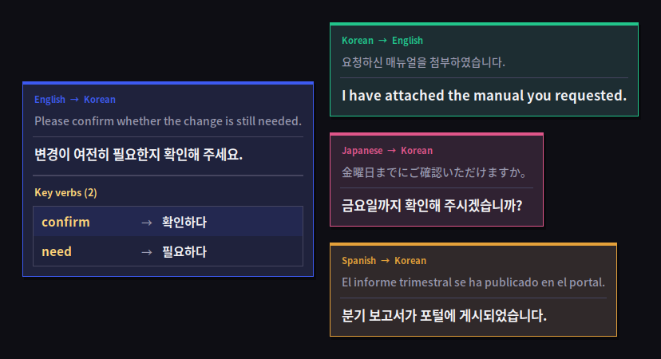
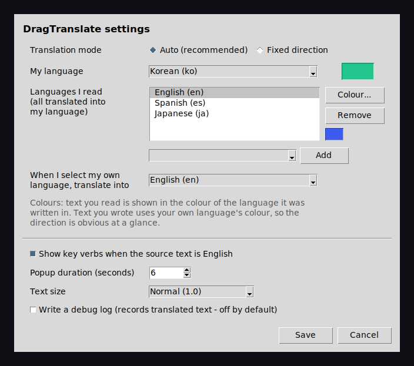

# DragTranslate — select text anywhere on Windows, get an instant translation popup

**Highlight any text in any Windows app and a translation appears right next to it.**
No hotkey, no copy-paste, no switching to a browser tab. Works in Outlook, Word, Excel,
PDF readers, chat apps, terminals, games — anywhere you can select text.

100+ languages · no API key · free and open source · single Python file



---

## Why this exists

Browser extensions that translate on hover are everywhere. But the moment you leave the
browser — a mail client, a spec sheet in Word, a PDF datasheet, a chat window — you are
back to copy, alt-tab, paste, read, alt-tab back.

DragTranslate is a small background app that fixes exactly that. Select text, read the
translation, carry on. It is the kind of tool that used to be filled by
[QTranslate](https://quest-app.appspot.com/) and similar utilities, rebuilt as a single
readable Python file you can inspect and modify.

## Features

- **Works in every application**, not just the browser
- **100+ languages** via Google Translate — no API key, no account, no cost
- **Set up as many languages as you like** — tell it your own language once, then list
  every language you want to read. English, Spanish and Japanese can all translate into
  Korean, and DragTranslate works out which is which on every selection. Nothing to switch.
- **Anything unlisted still works** — select a language you never configured and it is
  auto-detected and brought into your language anyway.
- **Per-language colours** — text you read is shown in the colour of the language it was
  written in, so Spanish and Japanese are instantly distinguishable even though both land
  in your language. Text *you* wrote uses your own language's colour, so the direction is
  obvious too. Fully customisable.
- **Reads well on any screen** — the popup widens rather than growing endlessly downward,
  shrinks to fit, and always lands fully inside the monitor you are working on. Correct on
  multi-monitor setups.
- **Never covers what you are reading** — it appears on the opposite side of the monitor
  from your cursor, and disappears the moment you click elsewhere or start typing.
- **Automatic vocabulary log** — every lookup is saved to a local SQLite file
  (`vocabulary.db`) with the source text, translation, languages and timestamp.
- **Key verb breakdown** (optional) — when the source is English, the popup also lists the
  main verbs with their translations. Handy when you are learning the language.
- **Tray icon** — toggle translation on/off, open settings, or quit. Like an antivirus:
  always there, off whenever you want.
- **Runs at log-in**, silently, with no console window.

## Install

**Requirements:** Windows 10 or 11. Nothing else — the installer takes care of Python.

1. **[Download the latest release](../../releases/latest)** and extract it somewhere
   permanent, such as `C:\DragTranslate`.
2. Double-click **`install.bat`**.

That is it. The installer runs hidden and shows a single dialog when it is finished. It
will find your Python, or download and install it per-user from python.org if you do not
have one, install the required packages, register DragTranslate to start when you log in,
and launch it.

Administrator rights are **not** required.

> **Windows may warn you** the first time — see [Why does my antivirus complain?](#why-does-my-antivirus-complain)
> below. This is expected for a tool that reads text selections system-wide, and the reason
> the whole thing is a single readable script you can check yourself.

<details>
<summary>Manual install (if you prefer, or you are not on Windows)</summary>

```bash
pip install -r requirements.txt
python dragtranslate.py
```

The translation and popup logic is portable, but the multi-monitor placement and the
"select in any app" trick use Windows APIs, so other platforms are untested.
</details>

## Using it

Select some text with the mouse. That is the whole interaction.

| Action | What happens |
| --- | --- |
| Drag-select text | Popup appears with the translation |
| Click anywhere / type | Popup disappears |
| Click the popup | Popup disappears |
| Right-click the tray icon | Toggle on/off, open settings, quit |

A plain click never triggers anything — you have to actually drag a selection, so normal
clicking around is unaffected.

### Settings

The settings window opens automatically on first launch, and any time from the tray icon.



- **Auto (recommended)** — set **My language**, then build a list of **languages I read**.
  Everything in that list is translated into your language; when you select your *own*
  language it goes to the outgoing language you pick. A language that is not on the list is
  auto-detected and translated into your language too.
- **Fixed direction** — always translate from one language (or auto-detect) into another.
- **Colour...** assigns a colour to the selected language. Text you *read* takes the colour
  of the language it was written in (English blue, Spanish orange, Japanese pink…), while
  text you *wrote* takes your own language's colour — so both the language and the
  direction are visible at a glance. The swatch beside **My language** sets that one.
- **Popup duration**, **text size**, and the **English verb list** are all adjustable.
- **Debug log** is off by default. It records translated text, so leave it off unless you
  are chasing a problem.

Example — a Korean speaker who reads English and Spanish sets *My language* to Korean,
adds English and Spanish to the list, and picks English as the outgoing language. Selecting
English or Spanish gives Korean; selecting Korean gives English; selecting German (not on
the list) still gives Korean.

Settings live in `config.json` next to the script, so you can also edit them by hand.

### Your vocabulary

Everything you look up goes into `vocabulary.db` (SQLite) in the app folder. Open it with
any SQLite viewer, or export it:

```bash
python -c "import sqlite3,csv,sys; c=sqlite3.connect('vocabulary.db'); w=csv.writer(sys.stdout); w.writerow(['source','translation','from','to','when']); w.writerows(c.execute('select source_text,translated_text,source_lang,target_lang,created_at from entries'))" > vocabulary.csv
```

## How it works

Windows has no API for reading another application's text selection, so DragTranslate uses
the approach every tool in this category uses:

1. A global mouse hook watches for a drag (press → move → release).
2. On release it saves your clipboard, sends a synthetic `Ctrl+C`, reads what landed in the
   clipboard, then puts your original clipboard contents back.
3. The text is sent to Google Translate through
   [`deep-translator`](https://github.com/nidhaloff/deep-translator).
4. The result is drawn in a borderless Tkinter window positioned on your current monitor.

### Making the synthetic Ctrl+C safe

That trick is the fragile part of every select-to-translate tool, and done naively it
causes real damage. DragTranslate guards against each failure mode:

| Hazard | What DragTranslate does |
| --- | --- |
| **Ctrl+C kills the running process in a terminal** — it means SIGINT there, not "copy" | Reads the foreground process name and refuses to fire in cmd, PowerShell, Windows Terminal, PuTTY, WSL, ConEmu, Hyper, Alacritty, WezTerm and friends. Extend the list via `blocked_apps` in `config.json`. |
| **Copied files and images are destroyed** — a text-only save/restore cannot put back a file you copied in Explorer | Snapshots *all* restorable clipboard formats as raw bytes (`CF_HDROP` for files, `CF_DIB` for images, HTML, RTF, Unicode text) and restores them afterwards. Disable with `preserve_clipboard: false`. |
| **Holding Shift or Alt turns it into a different shortcut** — `Ctrl+Shift+C` opens developer tools in browsers | Checks the real modifier key state first and skips the capture entirely if Shift, Alt or Win is held. |
| **Clipboard clobbered even when nothing was selected** | Uses `GetClipboardSequenceNumber()` to detect whether the copy actually produced anything. If nothing was copied, the clipboard is never written to at all. |
| **Fixed sleeps are wrong for slow apps** | Polls the clipboard sequence number instead — finishes in ~20 ms in a fast app, waits up to 600 ms for Excel or a remote desktop session. |

Two things are outside its control and worth knowing about:

- **Windows Clipboard History (`Win+V`) and cloud clipboard sync** will record text you
  select, because the copy is performed by the *target application*, not by DragTranslate.
  If that matters to you, turn them off in Settings → System → Clipboard.
- **Applications that block copying** (DRM-protected PDFs, some remote sessions) simply
  return nothing, and DragTranslate stays quiet.

Working out which of your configured languages a selection is written in needs no extra
dependency: distinctive scripts (Hangul, Kana, Han, Cyrillic, Arabic, Thai, Devanagari,
Greek, Hebrew and more) are identified by Unicode range, and languages that share the Latin
alphabet are separated with a small built-in stopword table. Install the optional
`langdetect` package and it will be used for the Latin-script cases instead. If nothing
matches, the text is sent with `auto` as the source language and translated into yours.

## Troubleshooting

### Why does my antivirus complain?

Because DragTranslate does three things that also describe a keylogger: it installs a
global mouse and keyboard hook, it reads and writes the clipboard, and it sends synthetic
keystrokes. There is no way to build a select-to-translate tool without them.

What it does *not* do: the keyboard hook exists solely to notice that you pressed *a* key
so it can close the popup — the key itself is never inspected, stored or transmitted.
Nothing is sent anywhere except the text you deliberately select, which goes to Google
Translate to be translated.

Everything is in [`dragtranslate.py`](dragtranslate.py) — one file, no build step, no
obfuscation. Read it before you run it.

### Selecting text does nothing in Outlook (or another app)

That app is probably running elevated, and Windows blocks a normal-privilege process from
sending keystrokes to an elevated window. Right-click `install.bat` and choose **Run as
administrator** once. It will then register DragTranslate as a scheduled task that starts
elevated at log-in, with no UAC prompt each boot.

### The popup does not appear at all

Check `install_log.txt` in the app folder. If the app started but nothing happens, enable
**Write a debug log** in settings and look at `dragtranslate.log`.

### "Translation failed"

The free Google Translate endpoint is unofficial and occasionally rate-limits or changes.
Usually waiting a moment and selecting again is enough. If it persists, the endpoint may be
blocked on your network.

## Privacy

Text you select is sent to Google Translate over the network in order to be translated.
Do not use this on confidential material unless that is acceptable to you and your
organisation. Everything else — settings, vocabulary, logs — stays in the app folder on
your machine. There is no telemetry and no account.

## Limitations

- Windows only in practice (uses Win32 APIs for monitor placement and input hooks).
- Uses the free, unofficial Google Translate endpoint. Fine for personal use; if you are
  building something commercial, switch to an official paid API (Google Cloud Translation,
  DeepL, Papago) or a local engine such as [Argos Translate](https://github.com/argosopentech/argos-translate).
- The verb breakdown is English-source only, because it relies on NLTK's English tagger.
- Some applications (certain games, hardened/DRM windows) do not respond to `Ctrl+C` and
  cannot be read.

## Contributing

Issues and pull requests are welcome. The whole app is one file — start at `main()`.
Ideas that would help: an offline translation backend, a proper vocabulary browser,
macOS/Linux support, more languages in the stopword table.

## Licence

[MIT](LICENSE) for this project's own code.

It depends on `pynput` and `pystray`, which are **LGPL-3.0** — they are installed as
separate packages by pip and are not bundled or modified here. See
[THIRD_PARTY_NOTICES.md](THIRD_PARTY_NOTICES.md) for the full list of dependencies and
their licences.

---

## 한국어

**윈도우 어디서든 텍스트를 드래그하면 그 자리에 번역 팝업이 뜨는 프로그램입니다.**

단축키도, 복사 붙여넣기도, 브라우저 전환도 필요 없습니다. 아웃룩, 워드, 엑셀, PDF 뷰어,
메신저 등 텍스트를 선택할 수 있는 모든 곳에서 동작합니다.

브라우저 확장 프로그램은 많지만 브라우저 밖으로 나가는 순간 쓸 수 없다는 점에서 출발한
도구입니다. 100개가 넘는 언어를 지원하고, API 키나 결제가 필요 없습니다.

### 설치

윈도우 10 또는 11이면 됩니다. 파이썬은 설치 파일이 알아서 처리합니다.

1. **[최신 릴리스를 내려받아](../../releases/latest)** `C:\DragTranslate` 같은 폴더에
   풀어주세요.
2. **`install.bat`** 을 더블클릭하세요.

검은 창 없이 조용히 설치되고, 끝나면 안내 창이 하나 뜹니다. 관리자 권한은 필요 없습니다.

### 사용법

마우스로 텍스트를 드래그하기만 하면 됩니다. 다른 곳을 클릭하거나 키를 누르면 팝업이
사라집니다. 그냥 클릭하는 것으로는 반응하지 않으니 평소 사용에 지장이 없습니다.

**여러 언어를 한 번에 등록할 수 있습니다.** 내 언어를 한국어로 지정하고, 읽고 싶은 언어
목록에 영어·스페인어·일본어를 넣어두면 그 언어들이 전부 한국어로 번역됩니다. 매번 방향을
바꿀 필요가 없고, 목록에 없는 언어를 드래그해도 자동으로 인식해서 한국어로 보여줍니다.
한국어를 드래그했을 때 어떤 언어로 번역할지는 따로 지정합니다.

언어마다 팝업 색을 다르게 지정할 수 있어서, 똑같이 한국어로 번역되더라도 원문이
스페인어였는지 일본어였는지 색만 보고 구분됩니다. 반대로 내가 쓴 한국어를 번역할 때는
내 언어의 색으로 떠서 방향도 한눈에 구분됩니다.

번역한 내용은 `vocabulary.db` 파일에 자동으로 쌓여서 나만의 단어장이 됩니다. 영어를
번역할 때는 주요 동사를 따로 뽑아서 함께 보여줍니다.

### 자주 겪는 문제

**백신이 경고해요** — 전역 마우스·키보드 후킹, 클립보드 접근, 가상 키 입력을 사용하기
때문입니다. 드래그 번역 기능을 만들려면 피할 수 없는 방식이고, 그래서 코드 전체를 파일
하나로 공개해 두었습니다. 키보드 후킹은 "키가 눌렸다"는 신호로 팝업을 닫는 데만 쓰고,
어떤 키인지는 확인하지도 저장하지도 않습니다.

**아웃룩에서 안 돼요** — 아웃룩이 관리자 권한으로 실행 중이면 일반 권한 프로그램이 키 입력을
보낼 수 없도록 윈도우가 막습니다. `install.bat` 을 우클릭해서 "관리자 권한으로 실행"을 한
번만 해주시면, 이후 부팅할 때마다 UAC 창 없이 관리자 권한으로 자동 실행됩니다.

**개인정보** — 드래그한 텍스트는 번역을 위해 구글 번역 서버로 전송됩니다. 회사 기밀 문서에
사용하실 때는 이 점을 고려해 주세요. 설정과 단어장은 전부 내 컴퓨터 안에만 저장됩니다.

---

<sub>Keywords: select to translate, drag to translate, translate text selection, popup
translator Windows, instant translation overlay, translate any application, screen
translator, QTranslate alternative, Google Translate desktop app, 드래그 번역, 마우스 드래그
자동 번역, 윈도우 번역 프로그램, 선택 번역, 팝업 번역기</sub>
